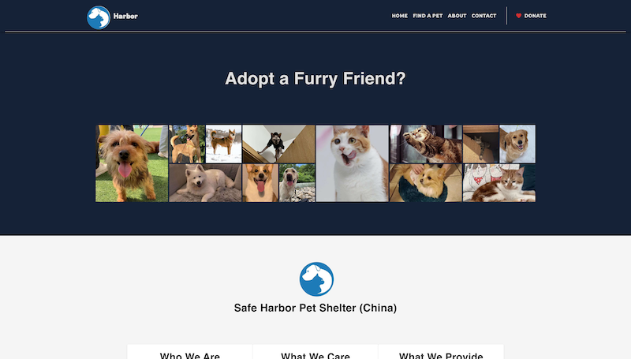
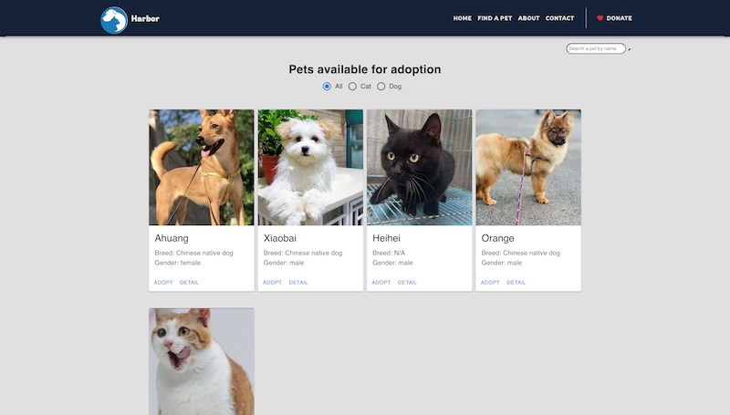
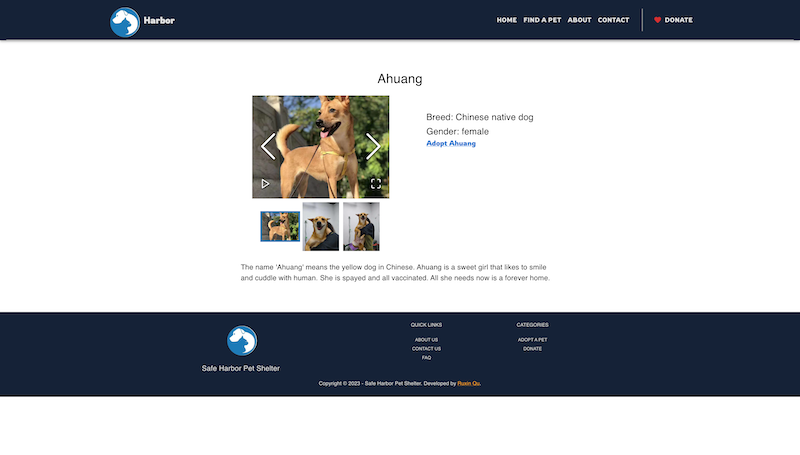
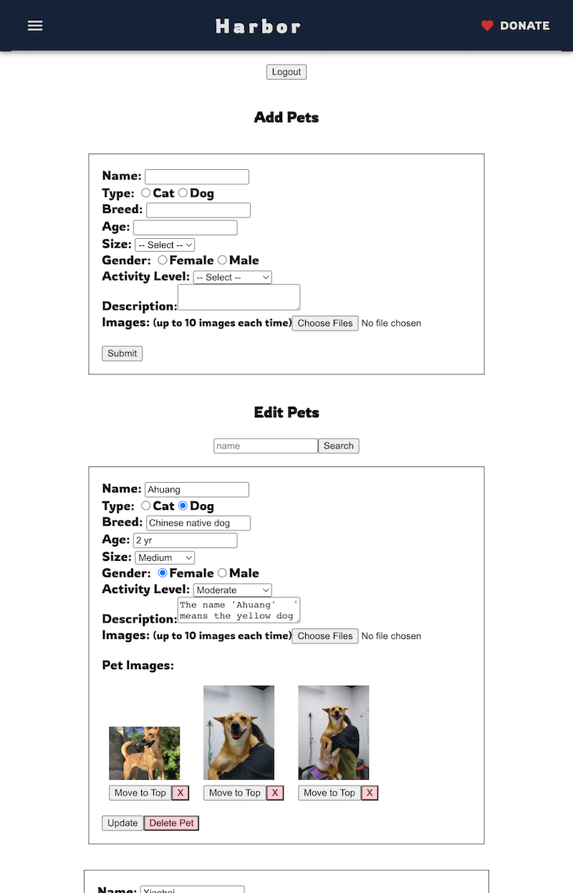

# Safe Harbor Pet Shelter

Email sending: [Nodemailer](https://nodemailer.com/about/)

Image uploading: [Multer](https://www.npmjs.com/package/multer), Cloud Storage: [Amazon S3](https://aws.amazon.com/s3/)

Authentication: [Bcrypt](https://www.npmjs.com/package/bcrypt), [Passport-Local](https://www.passportjs.org)

## Description

A full-stack PWA project for Safe Harbor Pet Shelter. Users can view the available pets and send adoption form to the shelter. An admin page has been added to enable the administrator to manage the pets' data.

To improve web performance, text compression has been enabled.

The deployed website can be accessed at https://safe-harbor-pet-shelter.herokuapp.com.

## Usage

1. Click on 'Find a Pet' in the menu bar to view all available pets for adoption and details about each pet.
1. Users can filter cats or dogs, or search for a pet by name.
1. If a user is interested in adopting a pet, they can complete and submit the adoption form.
1. Users can click on 'Learn More' or 'About Us' to learn more about Safe Harbor Pet Shelter. They can donate to the shelter, or contact the shelter through the contact form on the 'Contact' page.
1. An admin page has been added for easier management of pet information. If a user attempts to enter incorrect credentials **5** times on the Admin login page, the account will be locked for **15** minutes.
1. Administrators can add new pets, edit pet data, and delete pets through the admin page. The page supports multiple image uploads.
1. Click on the link to the deployed website and explore all features🎆! Hope that all of the furry babies will find their forever homes❤️.

### Screenshot(s)

- Home page.

  

- Pet page. Users are able to filter the pet result

  

- Pet Detail page, users can click the 'Adopt' button to access the adoption form and initiate the adoption process.

  

- The admin page. Supports editing text information, adding or removing images, and changing the cover image, etc...

  

## Contact

Bug report: ruxinqu@gmail.com or open an issue on this repository

Contact safeharborpetshelter@gmail.com if you would like to know more about the shelter.
